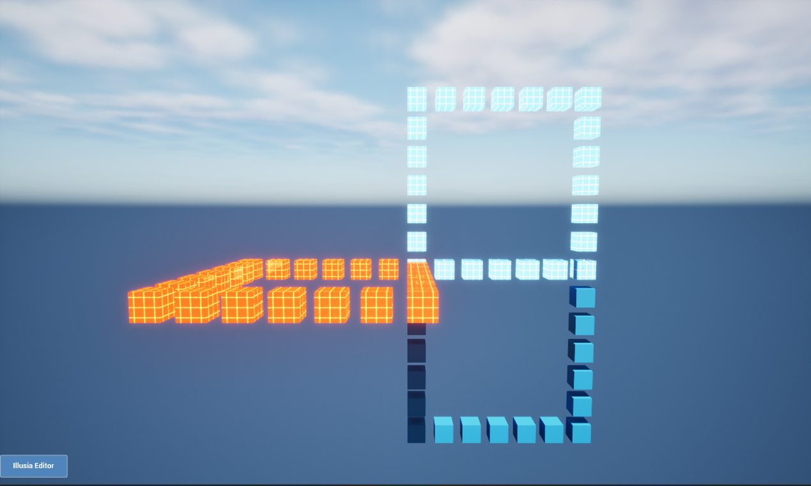
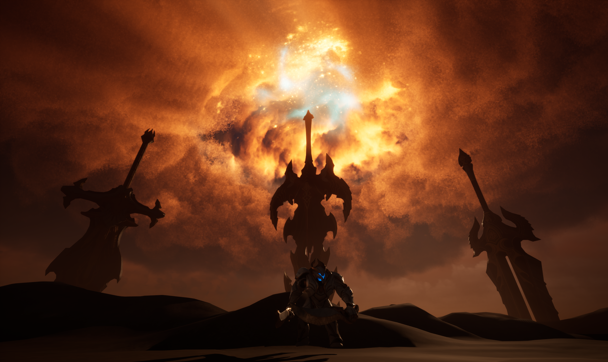
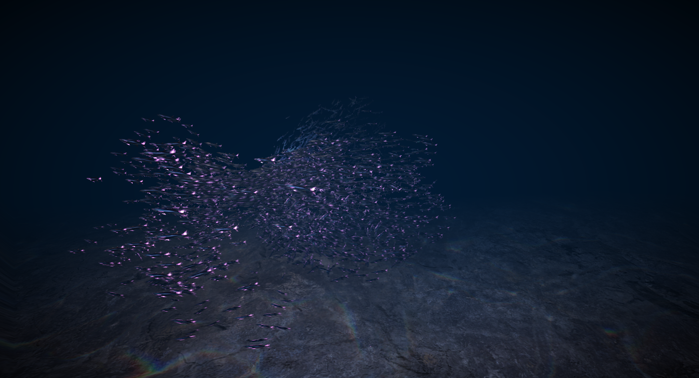
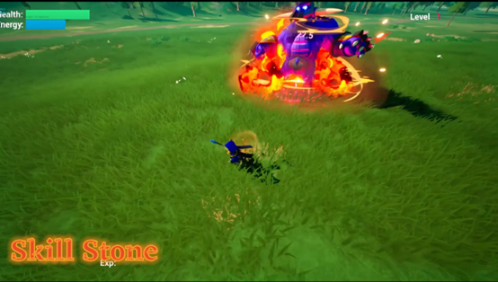
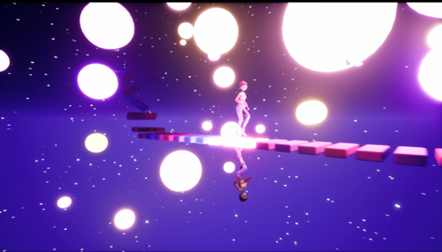
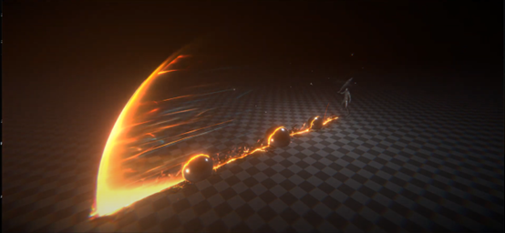
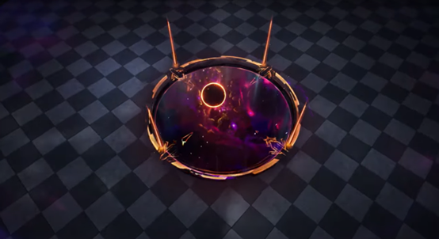

# Portfolio
- **Author:** Jiangwen(John) Nong
- **Email Address:** <jnong@wpi.edu>

## Vanity
Link of Video: [Vanity livecoding language](https://youtu.be/hD2ibEEiJw8?si=p1eV7uCI_sVkrCfC)  

I have been developing a live-coding language called Vanity as part of my master’s thesis project. Vanity's code follows an action-parameter command pattern, where the action specifies "what to do" and the parameters define "how to do it." Every executable part of a Vanity program adheres to this philosophy.

To make Vanity's syntax more engaging, I have encapsulated all available actions into diverse symbols. Some of these symbols are quite intuitive; for instance, ">>" represents "move right," and "<<" signifies "move left." I am currently exploring additional intuitive symbols to expand the language. Depending on the specific action, the number and type of parameters may vary. In general, there are three parameter types: float, integer, and string. While a command does not require parameters, it must always include an action.

At present, Vanity allows users to create predefined objects within a scene and edit their properties, such as materials, locations, and rotations. Additional advanced features are planned for future development.

## Simulation & Shaders
### Cloud Simulation: [Video](https://youtu.be/RiorTontwos?si=Llqvw8p5UVB5f8Zk)

This scene was created for my new game in the future. I focused mainly on the graphics of the scene, including God rays, visual particles, and volumetric clouds. Among these, the volumetric cloud rendering was the most complex. It involved using math equations and physics. The final effect was achieved by combining shader programming with Unreal Engine's default rendering pipeline.
By adjusting parameters in the shaders, the shape and color of the volumetric clouds can be easily customized.

### Flock Simulation: [Video](https://youtu.be/VPbRd0oR2uo?si=oz37gUitEcsvO-Kl)

In this project, my goal was to create an underwater world using post-processing effects and particles. The scene features multiple sardines, which are essentially particles. Their swimming animation was achieved entirely through shaders. By combining a sine function with world position offsets, I animated the sardine fish model without the need for rigging or premade animations. In Unreal Engine's Niagara system, I utilized the custom HLSL node to write HLSL code directly. Through this, I implemented a flock simulation algorithm. By integrating this algorithm with other Niagara modules, I was able to create the dynamic behaviors seen in the scene.

Another key element of this project was the post-processing. Instead of adding real water, I created a specialized shader for post-processing. This shader combines blur, animated distortion, and lens effects to simulate the underwater environment.

## Game Development
### Eternal Defender: [Video](https://youtu.be/VEQ5bQEw5_I)

This is a group project created for IMGD 5000 during the Fall 2023 semester. My primary focus was on developing the main character, a wizard. I implemented the locomotion system, the skill tree system, and the damage system. 

Each time the wizard defeats an enemy, there is a chance to collect crystals. These crystals can be used to restore health or mana, and under certain special conditions, they can also enhance the wizard's skills. Additionally, whenever the wizard levels up, the player can choose one buff from a selection of three cards. The project includes a variety of cards to offer diverse gameplay options.

### Fantasy Island: [Video](https://youtu.be/qNiURinjrlg?si=OdVF2KTskzJBFFd2)

This is a personal project created for IMGD 5010 during the Fall 2023 semester. My focus was on toon rendering, but I also implemented the locomotion system for the main character and NPC AI. The assets used in the project are mostly from the Epic Store. I used Unreal Engine's built-in tools for environmental modeling and created materials for the landscape. The toon shader was implemented through post-processing.

## Visual Effects
### Music Walking

Immersive Mode: [Immersive Video](https://youtu.be/aCcdN1xBSEU)

Interaction: [Record](https://youtu.be/zpHwOLUINDo)

In this project, I used a technique called Open Sound Control (OSC) to control animations, particles, and the skybox in Unreal Engine. Users can send OSC messages to a specific network port using applications like Touch OSC or others. The engine captures these OSC messages, and if the content of the messages is recognized and predefined, Unreal Engine will respond and provide visual feedback.

### Others: [Playlist](https://www.youtube.com/playlist?list=PLt2y7KVkS8MHkaV2iTJBa9qj40y0jfl8Q)

This playlist features some of my work from 2019 to 2022. Previously, I worked as a technical artist in the game industry, where I designed and created effects for character skills, environments, and user interfaces.
